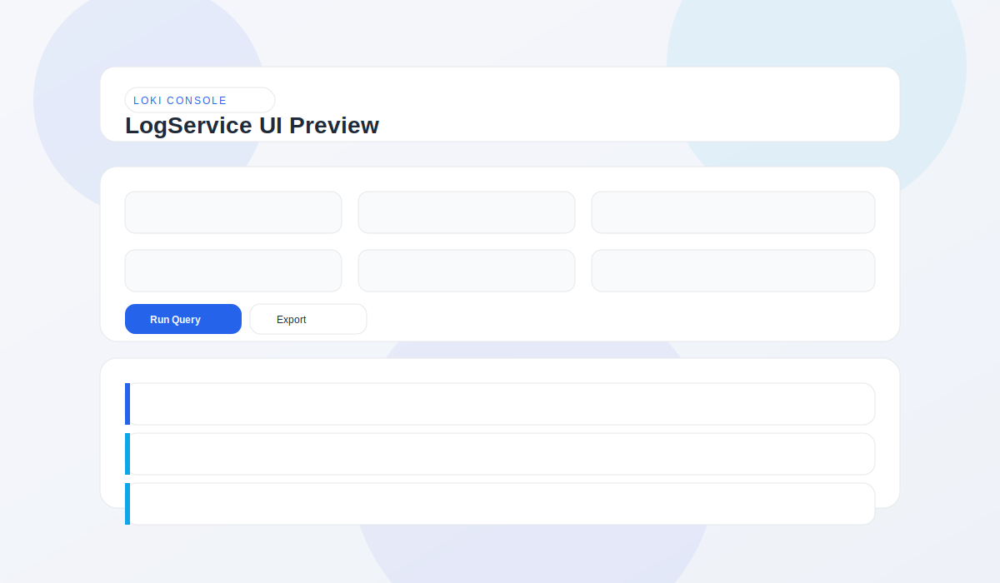

# LogService

Local-first Loki log capture and analysis service for TiDB Cloud components (tidb, pd, tikv, tiflash, tiflow, ticdc).

## Highlights
- Keyword + time range log retrieval with strict 100-line cap.
- Chat-style web UX and persistent local context.
- Skill library for reusable analysis prompts.
- Agent-ready multi-step log collection and analysis.
- Code correlation for local repo paths.

## Documents
- Requirements: `docs/requirements.md`
- Design: `docs/design.md`
- Test plan: `docs/test_plan.md`
- Installation (macOS): `docs/install.md`
- Metadata/Auth framework: `docs/metadata_auth_framework.md`
- Metadata/Auth inputs: `docs/metadata_auth_inputs.md`
- Agent integration inputs: `docs/agent_integration_inputs.md`

## Config
- Schema: `config/schema/cluster_config.schema.json`
- Example: `config/examples/cluster.example.json`

## UI Preview (Palette & Layout)
Open `docs/ui_preview.html` in a browser for the full static preview.



<table>
  <tr><th>Token</th><th>Color</th><th>Usage</th></tr>
  <tr><td>Background</td><td><span style="display:inline-block;width:48px;height:16px;background:#f4efe6;border:1px solid #e2d8c8;"></span> #f4efe6</td><td>Page background</td></tr>
  <tr><td>Panel</td><td><span style="display:inline-block;width:48px;height:16px;background:#ffffff;border:1px solid #e2d8c8;"></span> #ffffff</td><td>Cards/panels</td></tr>
  <tr><td>Text</td><td><span style="display:inline-block;width:48px;height:16px;background:#2b2a27;border:1px solid #e2d8c8;"></span> #2b2a27</td><td>Primary text</td></tr>
  <tr><td>Muted</td><td><span style="display:inline-block;width:48px;height:16px;background:#6b6760;border:1px solid #e2d8c8;"></span> #6b6760</td><td>Secondary text</td></tr>
  <tr><td>Accent</td><td><span style="display:inline-block;width:48px;height:16px;background:#1f4f5a;border:1px solid #e2d8c8;"></span> #1f4f5a</td><td>Primary actions</td></tr>
  <tr><td>Accent 2</td><td><span style="display:inline-block;width:48px;height:16px;background:#3a7ca5;border:1px solid #e2d8c8;"></span> #3a7ca5</td><td>Status accents</td></tr>
</table>

## Quick Start (Local)

### 1) Backend
```bash
python -m venv .venv
source .venv/bin/activate
pip install -r backend/requirements.txt
```

### 2) Environment
```bash
export LOGSERVICE_CONFIG=/path/to/cluster.json
export LOGSERVICE_MASTER_KEY=$(python - <<'PY'
from cryptography.fernet import Fernet
print(Fernet.generate_key().decode())
PY
)
```

### 3) Run API
```bash
uvicorn backend.app:app --reload --port 8000
```

### 4) Open UI
Visit `http://localhost:8000/ui`.

## macOS Client
```bash
cd client-mac
python -m venv .venv
source .venv/bin/activate
pip install -r requirements.txt
python app.py
```

## Tests
```bash
pip install -r requirements-dev.txt
pytest
```

## Notes
- Loki is the source of truth; LogService does not ingest or store raw logs.
- Results are capped at 100 lines per response to protect clusters.
- The UI is served from `/ui` by the backend.
- Code search accepts local paths or GitHub URLs (cached under `~/.logservice/cache/repos`).
